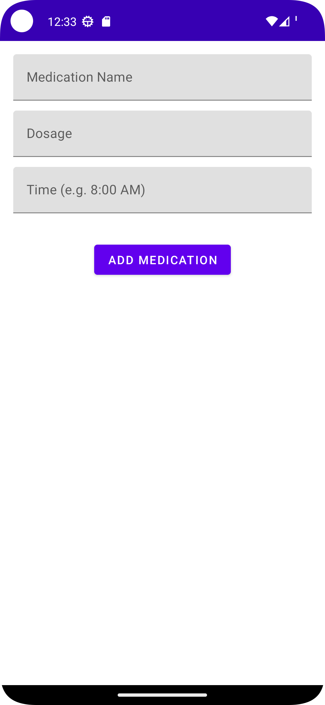
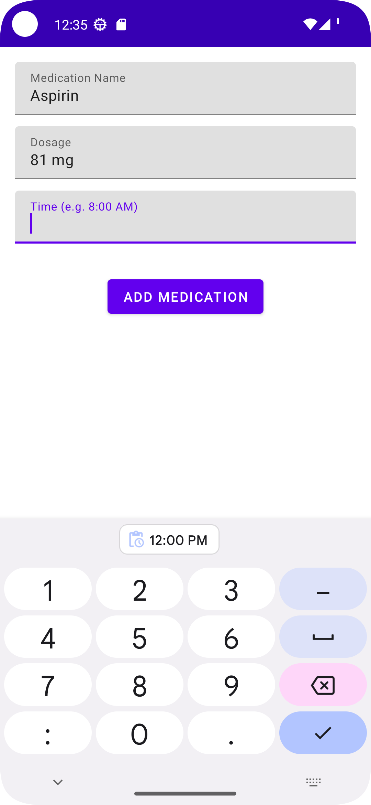
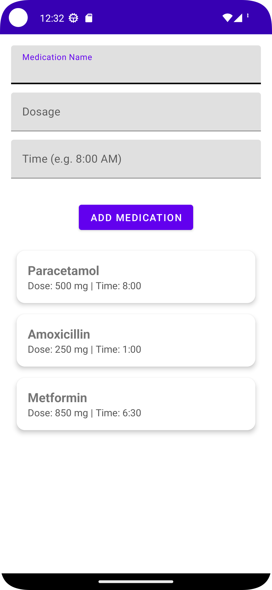

# MediTrack
MediTrack is a simple Android application that helps users track their medications. It allows users to enter medication details (name, dosage, time), view them in a card-based list, and receive reminders.

##  Features
- Add medications with name, dosage, and time.
- View medications in a modern CardView-based RecyclerView.
- Live updates using ViewModel and LiveData.
- Material Design UI with theme support.
- Optional reminder setup via AlarmManager (future-ready).
- Unit tested ViewModel logic.

## Tech Stack
- **Language**: Java
- **Framework**: Android SDK
- **Architecture**: MVVM (Model-View-ViewModel)
- **Libraries**:
  - Jetpack Components: ViewModel, LiveData, RecyclerView
  - Material Components (MaterialButton, TextInputLayout)
  - AlarmManager (for future reminder setup)

## Screenshots
| Initial Screen | Adding Input | Medication List |
|----------------|--------------|------------------|
|  |  |  |

## Unit Testing
- Tests for ViewModel: ensuring medication entries are stored and retrieved.
- LiveData tested using `InstantTaskExecutorRule`.

## Getting Started
1. Clone this repository.
2. Open with **Android Studio**.
3. Click **Run** or launch the app on your emulator/device.

## TODOs
-  Enable AlarmManager for actual medication reminders.
-  Add confirmation checkbox to log taken/missed meds.
-  Dashboard with charts (adherence %).
